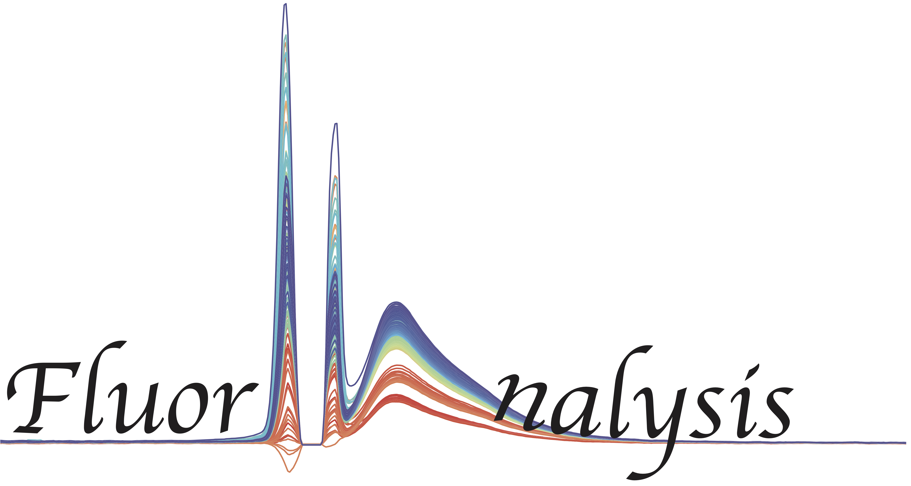

FluorA
=============================

Fluorescence Analysis Toolkit.

A basic Python package for reading, applying simple corrections, and plotting fluorescence data.

Requirements
------------

* Python_ 3.6 or later
* NumPy_ (vector and matrix algebra)
* MatPlotLib_ (for plotting)

Example:
------------

Reading in datafile and plotting:

* Intensity versus Wavelength.
* Intensity of a given wavelength versus time.

>>> from fluorA import *

>>> data = fluorAnalysis('directoryName')
>>> data.plot_Ilambda(plotColouring='rainbow')

.. _Python: http://www.python.org/
.. _NumPy: http://docs.scipy.org/doc/numpy/reference/
.. _MatPlotLib: https://matplotlib.org

